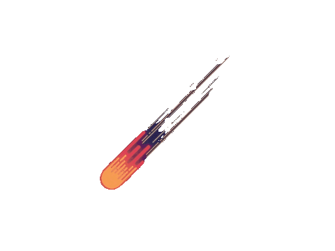

<h1 align="center">
    
</h1>

   Selamat Datang di Repo Saya! 

Halo! Saya **Farros Abdurrohman**, dan ini adalah repositori GitHub saya. Saya suka berkontribusi pada proyek-proyek open source serta Iot dan belajar hal-hal baru setiap hari. Jangan ragu untuk menjelajahi repositori saya dan memberikan masukan!

##  Tentang Saya 

- 🌱 saya sedang mempelajari **Teknologi Komputasi Awan (Cloud Computing) dan   Internet of Things (IoT)**
- 💬 Tanyakan tentang saya **Amazon Web Service(AWS),pemograman C/C++,HTML,PHP,Komputer & Jaringan,**
- 📫 Cara menghubungi saya: **farrosabdurrohman04@gmail.com**
- ⚡ Fakta menarik: **penjelajah linux, bangun private server, membuat tools dengan ai, coba coba hal baru**

##  Alat Tempur

Berikut adalah Alat yang saya gunakan:
